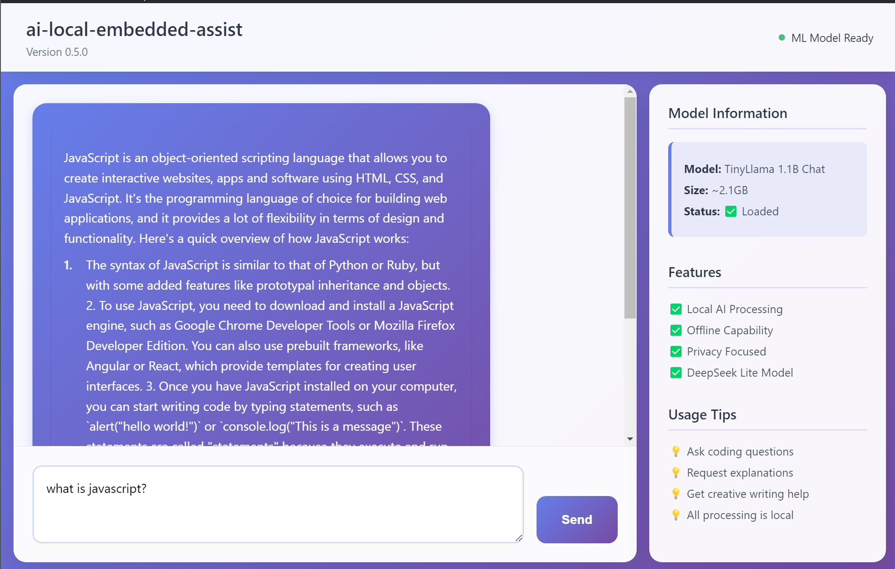

# AI Local Embedded Assistant (Beta)

A modern Electron application built with React and TypeScript that provides a local AI assistant interface. This app is designed to run lightweight NLP models locally on your device, ensuring privacy and offline capability.

## Features

- 🚀 **Local AI Processing** - Runs AI models directly on your device
- 🔒 **Privacy Focused** - No data sent to external servers
- 📱 **Offline Capability** - Works without internet connection



## Prerequisites

- Node.js (v16 or higher)
- pip (Python)

- npm or yarn package manager

## Installation

1. **Install dependencies**

   ```bash
   npm install
   ```

2. **if on Windows, Install Python dependencies**

   ```bash
   npm run install-python-deps
   ```

3. **if on linux, Python dependencies using Virtual Environments (Recommended)**

   ```bash
   python3 -m venv .venv
   source .venv/bin/activate
   pip install -r requirements.txt
   ```

4. **Start development server**
   ```bash
   npm run dev
   ```

## Available Scripts

- `npm run dev` - Start development mode (both renderer and main process)
- `npm run build` - Build the application for production
- `npm run dist` - Build and package the application
- `npm run dist:win` - Build for Windows
- `npm run dist:mac` - Build for macOS
- `npm run dist:linux` - Build for Linux

## Project Structure

```
ai-local-embedded-assist/
├── src/
│   ├── main/           # Electron main process
│   │   ├── main.ts     # Main process entry point
│   │   └── preload.ts  # Preload script for security
│   └── ui/             # React ui process
│       ├── main.tsx    # React entry point
│       ├── App.tsx     # Main App component
│       ├── App.css     # Component styles
│       └── index.css   # Global styles
├── dist/               # Built files
├── release/            # Packaged applications
├── index.html          # HTML entry point
├── package.json        # Dependencies and scripts
├── tsconfig.json       # TypeScript config (ui)
├── tsconfig.main.json  # TypeScript config (main)
├── tsconfig.node.json  # TypeScript config (Node.js tools)
└── vite.config.ts      # Vite configuration
```

## AI Model Integration

The application is designed to integrate with local AI models. Here's how to add your own model:

1. **Model Integration**: Choose a lightweight NLP model that can run on local hardware. You can use frameworks like TensorFlow Lite, that allow you to run models directly in the Electron app.

2. **Packaging the Model**: Include the model files within your Electron application's directory. This way, the model is always available for offline use.

3. **Local Inference**: Use a JavaScript library like TensorFlow.js to load the model and perform inference directly within the app.
